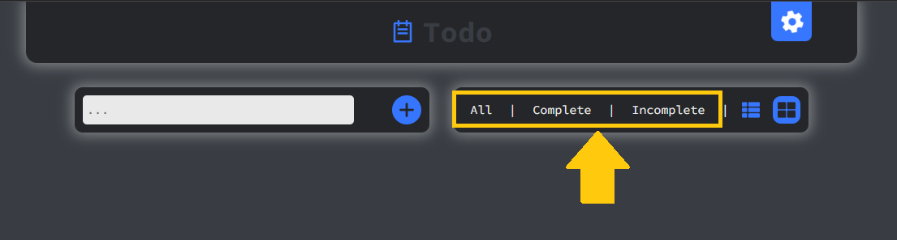

# Todo: Проект розроблений для зручності упорядкуванню повсякденних справ.

[Посилання на проект](https://todo-list-one-kappa-71.vercel.app/)

# Запуск проекта Todo

Цей проект розроблений для запису списку справ, керування та відслідкувування. Для запуску проекту, виконайте наступні кроки:

1. Склонуйте репозиторій на свій комп'ютер, використовуючі наступні команди в командній стрічці:

```
git clone https://github.com/UserBRAvo99/todo-list.git
```

2. Перейдіть в папку з проектом:

```
   cd todo-list
```

3. Встановіть залежності, використовуйте менеджер залежностей `npm`:

```
   npm install
```

4. Запустіть проект, використавши команду:

```
   npm run dev
```

# Список технологій, які були використані:

| Технологія        | Опис                                                                |
| ----------------- | ------------------------------------------------------------------- |
| React             | JavaScript- бібліотека для створення користувацьких проектів        |
| Redux-Toolkit     | Офіційно рекомендований набір інструменти для роботи з Redux        |
| Styled Components | Бібліотека для створення компонентів за допомогою CSS в JavaScript  |
| Vite              | Швидкий інструмент для збірки і розробки веб-додатків на JavaScript |

## Функціонал

Нижче представлений список функціонала, реалізованого в проекті:

- Створення та видалення списку справ або задач
- Фільтрація списку за тегами - всі/виконані/невиконані
- Зміна розташування задач, колонкою або таблицею
  
- Налаштування мови та теми в вікні налаштувань

## Поведінка

Додаток надає зручний інтерфейс для прегляду та взаємодії з задачами чи списками.

Додаток також надає відгучний дизайн, для зручного використання на різних пристроях.
